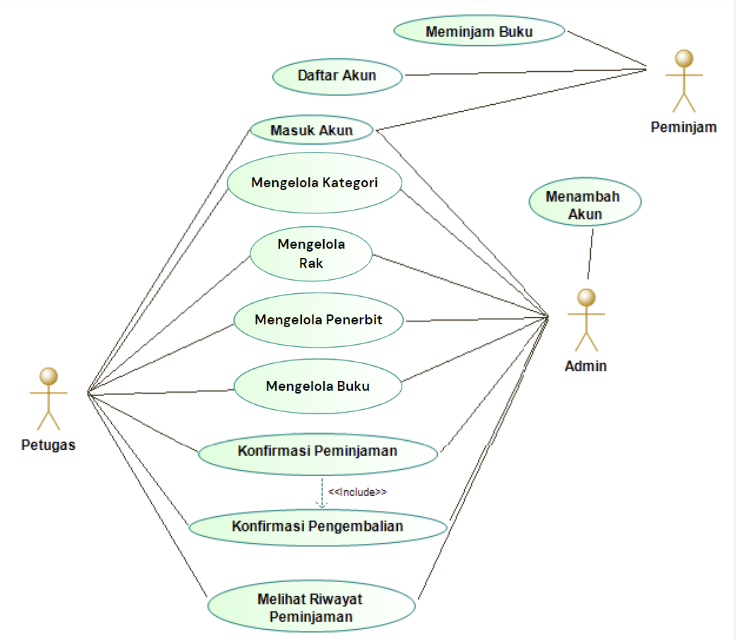

# PROJEK AKHIR PEMROGRAMAN WEB 2023

## Identitas Tim

Dosen Pengampu : Aryo Pinandito, S.T., M.MT, Ph.D<br />
Kelas : SI - D<br />

> **_Kelompok 1_**<br />
> Fatikah Izza Maulidina<br />
> Nadila Zahro Aisyah<br />
> Puja Ramadhan Nita<br />
> Reynaldi Holtrop<br />
> Bonaventura Julio Putra Nandika<br />

## Detil Projek

Deskripsi Website : Website yang digunakan untuk mengelola peminjaman buku<br />
Aktor : Admin, Petugas, Peminjam<br />
Framework : Laravel, Livewire<br />

# CARA PENGGUNAAN

## Buka Git Bash dan arahkan direktori ke htdocs pada instalasi XAMPP

```
cd /path/to/htdocs
```

## Klone repository

```
git clone https://gitlab.com/bnvt151/projek-akhir-pemweb
```

## Buat database MySQL dengan nama perpustakaan

```
create database perpustakaan;
```

> **_Default konfigurasi pada repository ini adalah_**<br />
> Database : MySql<br />
> Database Name : perpustakaan<br />
> Server : localhost<br />
> Username : root<br />
> Password :<br />

## Buka terminal pada Visual Studio Code

## Instal dependencies

```
composer install
```

## Generate kunci aplikasi

```
php artisan key:generate
```

## Jalankan migrasi dan seeder

```
php artisan migrate --seed
```

## Buat tautan storage

```
php artisan storage:link
```

## Jalankan server web lokal

```
php artisan serve
```

## Pastikan web server dan database aktif

Akses [localhost](http://127.0.0.1:8000)

# USE CASE DIAGRAM

()
